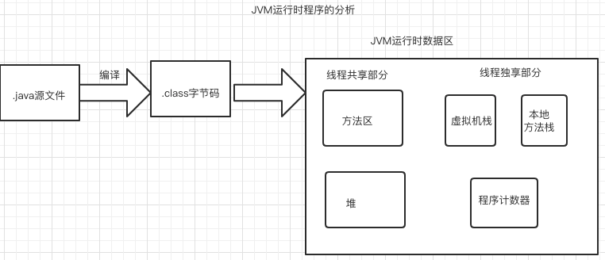

#### 1.JVM运行时的数据区

##### 1.1 JVM分区  


**相关概念**
线程共享：所有线程都可以访问这块内存的数据，随着虚拟机或者GC而创建或者销毁。  
线程独享：每个线程都有会它独立的空间，随线程生命周期而创建和销毁。

| 名称    | 概念理解     |
| :------------- | -------------- |
| 方法区       | 属于共享内存区域，储存已被虚拟机加载的类的信息、常量、静态变量。即是编译器编译后的代码等数据。 |
| 堆 | 属于共享内存区域，主要是存放对象实例和数组。 |
| 本地方法栈 | 属于线程私有区域，主要是执行本地native方法。 |
| 虚拟机栈 | 属于线程私有区域，每个方法在执行的时候都会创建一个栈帧(stack frame)用于存储局部变量表、操作数栈、动态链接、方法出口等。<br />局部变量表：存放了编译器已知的各种基本数据类型。（byte、int、short、long、double、folat、boolean、char） |
| 程序计数器 | 记录程序运行的位置：执行java方法的时候，存放的是正在执行的虚拟机字节码指令的地址，执行Native方法的时候，存的是undefined。 |


##### 1.2 查看class文件的内容

**源代码**

```java
public class Demo1 {
    public static void main(String[] args) {
        int a = 7;
        int b = 11;
        int c = a + b;
        int d = 2;
        System.out.println(c+d);
    }
}
// 编译
javac Demo1.class
//查看内容
javap -v Demo1.class>Demo1.class
```

**查看编译后的内容**

```java
Classfile /Users/nuc/studyspace/studydemo1/src/main/java/com/class1/chapter1/demo1.class
  Last modified 2021-2-21; size 432 bytes
  MD5 checksum dc81fd6f7339927b982f23feee6b75ba
  Compiled from "Demo1.java"
public class com.class1.chapter1.demo1
  minor version: 0
  major version: 52
  flags: ACC_PUBLIC, ACC_SUPER
Constant pool:
   #1 = Methodref          #5.#14         // java/lang/Object."<init>":()V
   #2 = Fieldref           #15.#16        // java/lang/System.out:Ljava/io/PrintStream;
   #3 = Methodref          #17.#18        // java/io/PrintStream.println:(I)V
   #4 = Class              #19            // com/class1/chapter1/demo1
   #5 = Class              #20            // java/lang/Object
   #6 = Utf8               <init>
   #7 = Utf8               ()V
   #8 = Utf8               Code
   #9 = Utf8               LineNumberTable
  #10 = Utf8               main
  #11 = Utf8               ([Ljava/lang/String;)V
  #12 = Utf8               SourceFile
  #13 = Utf8               Demo1.java
  #14 = NameAndType        #6:#7          // "<init>":()V
  #15 = Class              #21            // java/lang/System
  #16 = NameAndType        #22:#23        // out:Ljava/io/PrintStream;
  #17 = Class              #24            // java/io/PrintStream
  #18 = NameAndType        #25:#26        // println:(I)V
  #19 = Utf8               com/class1/chapter1/demo1
  #20 = Utf8               java/lang/Object
  #21 = Utf8               java/lang/System
  #22 = Utf8               out
  #23 = Utf8               Ljava/io/PrintStream;
  #24 = Utf8               java/io/PrintStream
  #25 = Utf8               println
  #26 = Utf8               (I)V
{
  public com.class1.chapter1.demo1();
    descriptor: ()V
    flags: ACC_PUBLIC
    Code:
      stack=1, locals=1, args_size=1
         0: aload_0
         1: invokespecial #1                  // Method java/lang/Object."<init>":()V
         4: return
      LineNumberTable:
        line 7: 0

  public static void main(java.lang.String[]);
    descriptor: ([Ljava/lang/String;)V
    flags: ACC_PUBLIC, ACC_STATIC
    Code:
      stack=3, locals=5, args_size=1
         0: bipush        7
         2: istore_1
         3: bipush        11
         5: istore_2
         6: iload_1
         7: iload_2
         8: iadd
         9: istore_3
        10: iconst_2
        11: istore        4
        13: getstatic     #2                  // Field java/lang/System.out:Ljava/io/PrintStream;
        16: iload_3
        17: iload         4
        19: iadd
        20: invokevirtual #3                  // Method java/io/PrintStream.println:(I)V
        23: return
      LineNumberTable:
        line 9: 0
        line 10: 3
        line 11: 6
        line 12: 10
        line 13: 13
        line 14: 23
}
SourceFile: "Demo1.java"
```


##### 1.3 解释理解

> 版本号和访问修饰符

52表示为JDK8

```
  minor version: 0	//次版本号
  major version: 52 //主版本号
  flags: ACC_PUBLIC, ACC_SUPER //访问标志
```

> 常量池：Constant pool部分（暂时忽略掉这部分的解释）
>
> class内容：构造方法

这个demo中我们没有写构造函数，由此可见，没有定义构造函数的时候，会有隐式的无参构造函数。

```
public com.class1.chapter1.demo1();
    descriptor: ()V
    flags: ACC_PUBLIC
    Code:
      stack=1, locals=1, args_size=1
         0: aload_0
         1: invokespecial #1                  // Method java/lang/Object."<init>":()V
         4: return
      LineNumberTable:
        line 7: 0
```

> main方法

```java
public static void main(java.lang.String[]);
    descriptor: ([Ljava/lang/String;)V
    flags: ACC_PUBLIC, ACC_STATIC				//描述了访问控制，public，static
    Code:
      stack=3, locals=5, args_size=1		// 描述了 方法对应栈帧中操作数栈的深度：3 ；参数数量：5（a,b,c,d 本地变量）；本地变量：1
         0: bipush        7             // 将 7 这个数值放入操作数栈
         2: istore_1									  // 将栈顶int类型值保存到局部变量1中。 （挪过去后操作数栈就没数据了。）
         3: bipush        11						// 将 11 这个数值放入操作数栈
         5: istore_2										// 将栈顶int类型值保存到局部变量2中。（将11 挪到局部变量表，变量2）
         6: iload_1											// 从局部变量1中装载int类型值入栈。 （将 7压入操作数栈）
         7: iload_2											// 从局部变量2中装载int类型值入栈。  （将 11压入操作数栈）
         8: iadd												// 将栈顶两int类型数相加，结果入栈。（栈中就只有18了）
         9: istore_3										// 将栈顶int类型值保存到局部变量3中。（局部变量中，变量3 为18）
        10: iconst_2										// 2(int)值入栈。
        11: istore        4							// 将栈顶int类型值保存到局部变量4
        13: getstatic     #2                  // Field java/lang/System.out:Ljava/io/PrintStream;  获取静态字段的值。
        16: iload_3											// 从局部变量3中装载int类型值入栈。（将18压入栈）
        17: iload         4							// 从局部变量4中装载int类型值入栈。（将2压入栈）
        19: iadd												// 将栈顶两int类型数相加，结果入栈。18 + 2
        20: invokevirtual #3                  // Method java/io/PrintStream.println:(I)V
        23: return
```

想要清楚理解这里，就需要参照JVM指令码表
