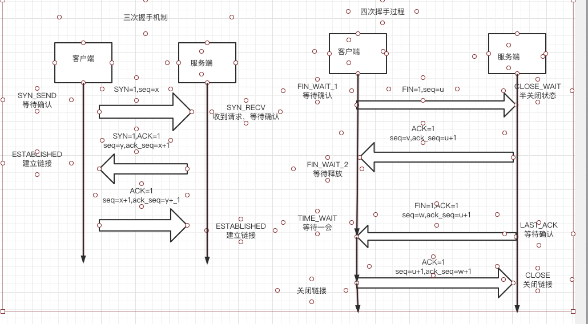

#### 1.OSI网络七层模型
#####1.1 各层的主要功能
  低三层：
    物理层：使原始的数据比特流能在物理介质上传输。
    数据链路层：通过效验、确认和反馈重发等手段，形成稳定的数据链路。（01010101）
    网络层：进行路由选择和流量控制。（ip协议）

    传输层：提供可靠的端口到端口的数据传输服务（tcp/udp服务）。

  高三层：
    会话层：负责建立、管理和终止进程之间的会话和数据传输
    表示层：负责数据格式转换。数据加密与解密、压缩与解压缩等
    应用层：为用户的应用进程提供网络服务。

####2. 传输控制协议TCP
  传输控制协议（TCP）是一个Internet一个重要的传输协议。TCP提供面向链接、可靠、有序、字节流传输服务。应用程序在使用TCP之前，必须先建立TCP链接。
#####2.1 TCP的握手机制

####3. 用户数据报协议UDP  
用户数据报协议UDP是一个Internet传输层协议。提供无连接、不可靠、数据报尽力传输服务

开发应用人员在udp上构建应用，应该关注一下几点：
1：应用进程更容易控制发送什么数据以及何时发送
2：无需建立链接
3：无连接状态
4：首部开销小

#####3.1 tcp和udp的比较
| TCP | UDP     |
| :------------- | :------------- |
| 面向链接       | 无链接       |
| 提供可靠性的保证       | 不可靠       |
| 慢       | 快       |
| 资源占用多       | 资源占用小       |

#####3.2 什么情况下会用到UDP
物联网：状态，日志上报等。偶尔丢数据无影响。

####4.Socket编程
主要socket的API以及调用过程
创建套接字-> 端点绑定 -> 发送数据 -> 接收数据 -> 释放套接字
