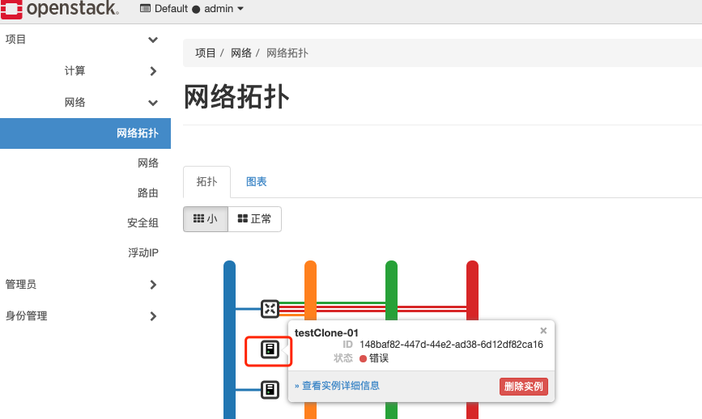
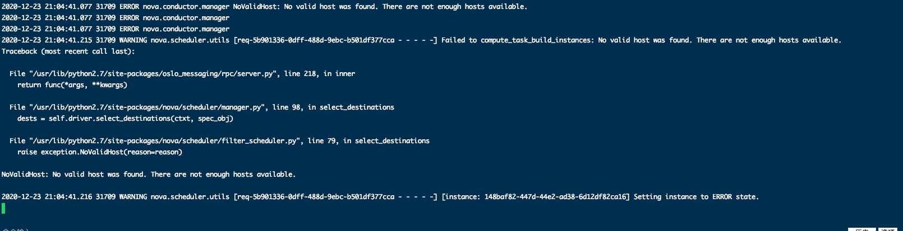
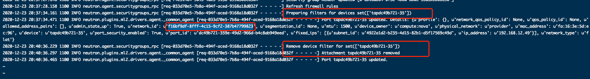
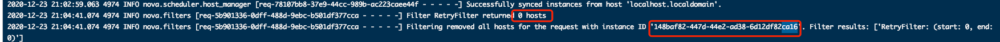

#### 1:创建超时
  No valid host was found. There are not enough hosts available.

查看日志的技巧——重点看scheduler 日志中的Filter字段来确定哪种资源不足

##### 1.1 排查过程
>>>1.1.1 查看网络拓扑图
创建VM时直接使用了外部网络，则报no valid host was found 错误。查看拓扑图会发现这台VM没有链路。

>>>1.1.2 查看日志

查看computer日志  
controller节点 nova-conductor日志：

查看linuxbridge-agent.log日志

查看nova-scheduler日志

>>>1.1.3

**分析：** 上述日志中有大量port相关报错。根本原因是上面提到的创建虚拟机时不能直接使用外部网络(即无法给VM分配port)。如果要访问外部网络，必须经过路由器中转。

**处理：** 使用内部网络（私有网络/private网络）或者shared类型的外部网络创建虚拟机
