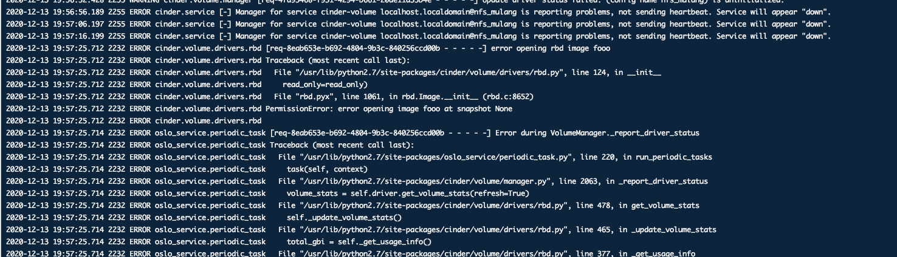
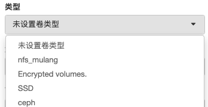
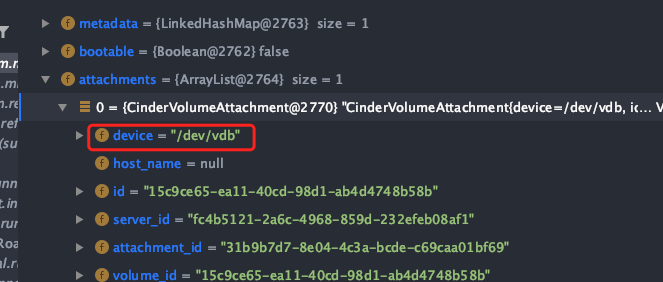
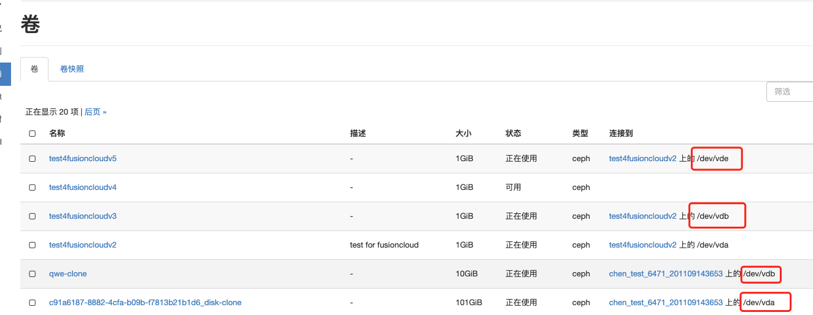

### 1.248上cinder的日志一直有这个错误，不清楚是什么原因

### 2.有个卷，删除失败
页面，cli命令行，api都调用试过，无其他明显报错，查看cinder日志，只有上图的报错

cinder delete 9690a477-9b4b-48f3-a176-8722aeb225f0

id： 9690a477-9b4b-48f3-a176-8722aeb225f0

name：test4fusioncloudv4

### 3. 卷的类型的设置有什么影响嘛？

不同卷的类型，是对应不同的pool吗 ？例如ceph，则对应的pool为volumes，是怎么理解嘛？

### 4.对于device应该怎么理解？

查询卷的详细信息的时候有device这个字段

这个字段表示什么含义？跟poolname有什么对应关系嘛？

以为之前的备份调试不通的问题就出现在这里。

执行rbd diff的时候
rbd diff poolname/rbdimg

之前问题就是出现在，没注意到这个poolname，openstack的默认应该是volumes，但是我传的是这个device。（/dev/vdb）所以导致找不到相应的文件
