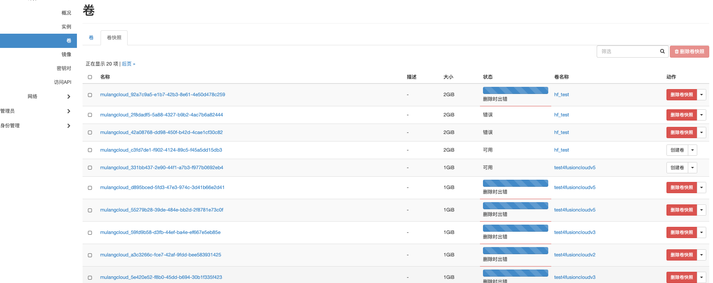

问题：

之前ceph异常，导致cinder-volume的服务挂掉了，多个调度任务没有执行成功，状态为异常，无法正常删除，详情见下。

openstack volume snapshot list

修改镜像的快照状态为正常
openstack volume snapshot set 71b69aa7-231f-42fc-810b-8dc9b1969a51 --state available
检查下
openstack volume snapshot show 45582099-6d89-416e-abd7-f96d0cbbd64f
删除该快照
openstack volume snapshot delete ea989f8f-842b-4cb7-b6a1-d64cc387088c
